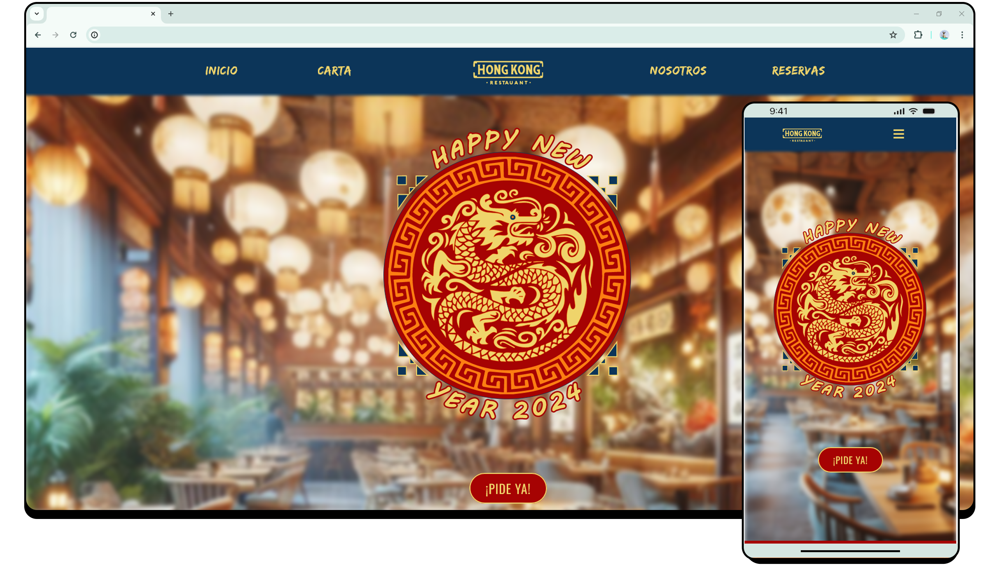
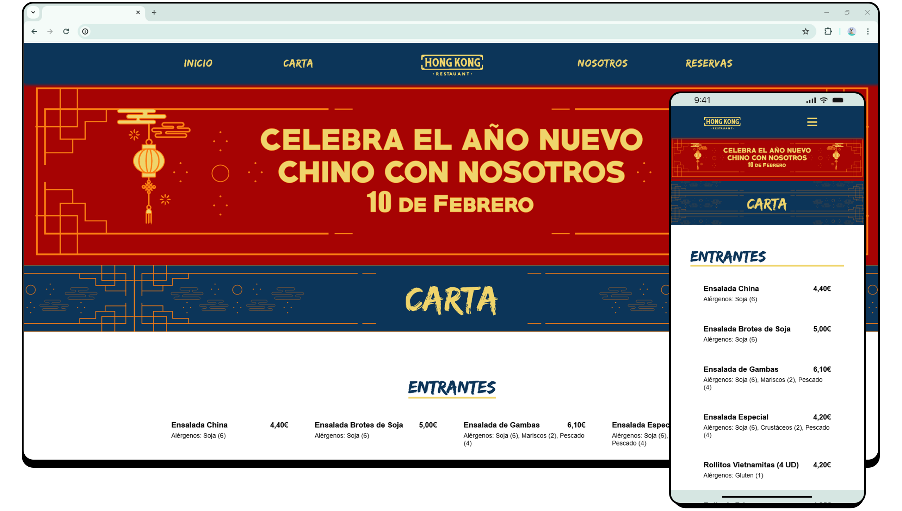
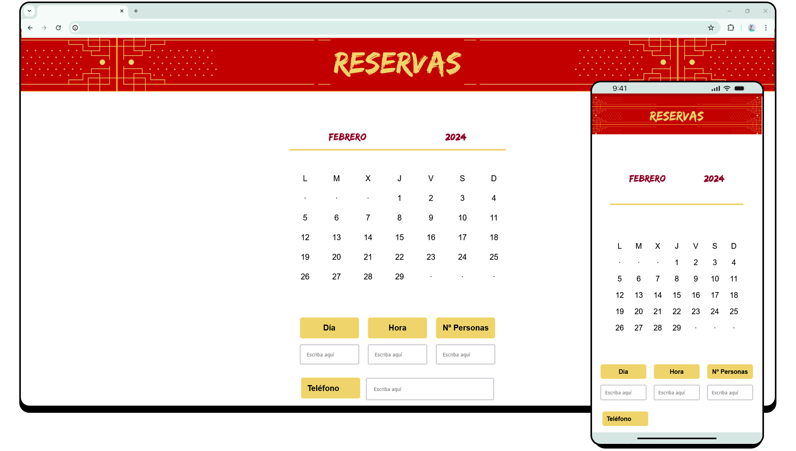

# Hong Kong Restaurant

## Contenidos
  - [Descripción](#description)
  - [Wireframes](#wireframes)
  - [Vista previa](#vista-previa)
  - [Tecnologías ](#Tecnologías)
  - [Autoría y Créditos](#auditoría-y-créditos)

## Descripción

Este proyecto presenta un rediseño conceptual para el restaurante chino "Hong Kong". Se ha enfocado en recrear una página de un restaurante que ofrece comida a domicilio mediante llamada telefónica, reservas online y donde se podrá ver la carta que se ofrece.

La temática está ambientada en el año nuevo chino por lo que contiene imágenes y mensajes dedicados.

## Wireframes

Diseño previo de la nueva estructura que tendrá la página del restaurante.

## Vista previa

Aquí se muestran unos mock ups de cómo se vería la página en el navegador y en el móvil.

## Tecnologías

Para llevar a cabo este proyecto he utilizado:
  - IDE
      - Visual Studio Code
  - Lenguajes
      - HTML
      - CSS
      - Javascript (para el menú responsive)
   
## Auditoría y Créditos 

Este proyecto ha sido creado por mí, sin ánimo de lucro y con la única intención de poder crear una página visualmente atractiva y de fácil navegación.
